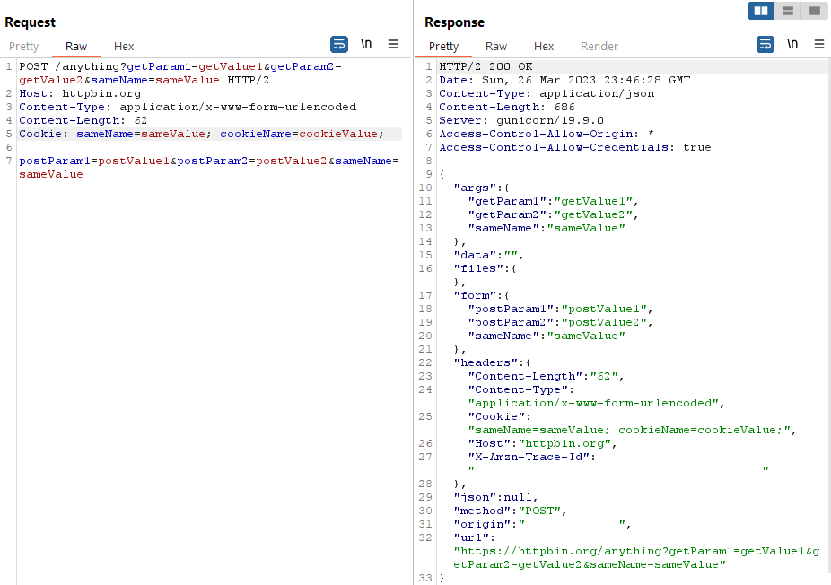

# About
Burp Suite extension for shortening bothering request parameters.

The extension was developed using the new Burp Extensions API - [Montoya](https://github.com/PortSwigger/burp-extensions-montoya-api).

Inspired by [.NET Beautifier](https://github.com/PortSwigger/dotnet-beautifier).

# Use case
1. Original request in the Repeater tab:

2. Custom settings tab with added parameters to be shortened:

3. Custom request editor with shortened parameters:

4. Custom request editor with shortened, updated, and new parameters. Notice that the extension restores original parameter values, updates previous and adds new ones. 

# References
* [Custom Request Editor Tab Example Extension](https://github.com/PortSwigger/burp-extensions-montoya-api-examples/tree/main/customrequesteditortab)
* [Developing and Debugging Java Burp Extensions with Visual Studio Code](https://parsiya.net/blog/2019-12-02-developing-and-debugging-java-burp-extensions-with-visual-studio-code/)
* [Java Swing layouts](https://www.youtube.com/watch?v=19xwjgsC_58)

# TODO
* JSON support
* Custom placeholder
* Separate enabled/disabled option for parameter